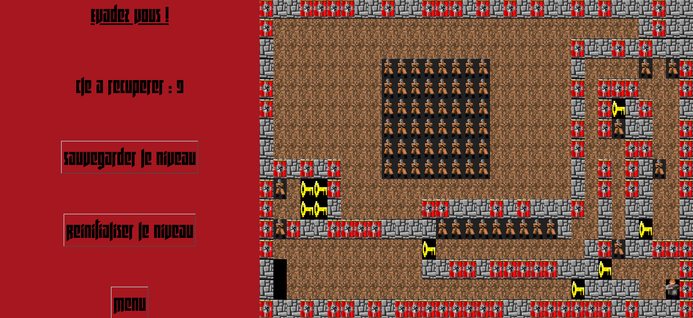
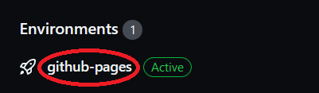
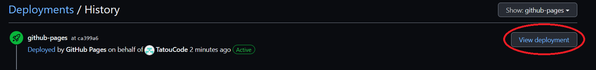

<h1 align="center">
Boulder Dash : Wolfenstein Edition
</h1>

Vous êtes prisonnier des nazis ! Echappez vous !

  

 

Récupérer toutes les clés des différents niveaux pour vous échapper

  

<h1 align="center">
Lancement du jeu
</h1>

Cliquez sur "github-pages" qui se situe en bas à droite de l'onglet code

  

Puis cliquez sur le bouton "View deployment"

  

